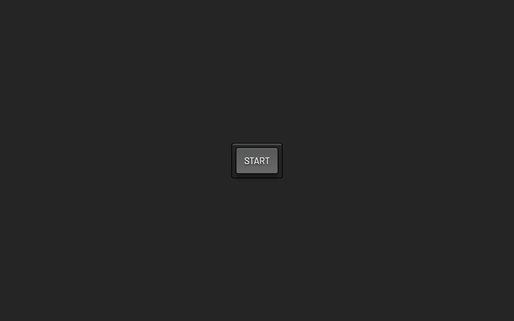

# Picture in Picture | ZTM JS Web Projects Course

**Project 3/20**

A minimalist Picture-in-Picture (PiP) web app that allows users to share their screen and pop it out into a floating video window using the browser's native Picture-in-Picture API. Clean design, one-click interaction, and a focused learning experience on media APIs.

---

## 📚 Table of Contents

- [🔎 Overview](#-overview)
  - [📸 Screenshot](#-screenshot)
  - [🔗 Links](#-links)
  - [📌 Features](#-features)
  - [🛠️ Built with](#️-built-with)
- [🧠 My process](#-my-process)
  - [🗃️ Useful resources](#️-useful-resources)
  - [🔙 Previous Project](#-previous-project)
  - [🔜 Next Project](#-next-project)
- [👤 Author](#-author)
  - [🌐 Connect with Me](#-connect-with-me)
  - [💻 Coding Profiles](#-coding-profiles)

---

## 🔎 Overview

### 📸 Screenshot

### 🔗 Links

- [🔴 Live Demo](https://dalascript.github.io/picture-in-picture/)
- [🗂️ GitHub Repository](https://github.com/DalaScript/picture-in-picture)

### 📌 Features

- ✅ Prompts the user to select a screen to share
- ✅ Streams the selected screen into a hidden video element
- ✅ Allows starting Picture-in-Picture with a single click

### 🛠️ Built with

- HTML5
- CSS3
- Vanilla JavaScript
- Picture-in-Picture Web API
- MediaDevices API (`getDisplayMedia()`)

---

## 🧠 My Process

### 🗃️ Useful resources

- [Google Fonts](https://fonts.google.com/)
- [CSS Tricks - Picture-in-Picture Guide](https://css-tricks.com/an-introduction-to-the-picture-in-picture-web-api/)
- [MDN - Screen Capture API](https://developer.mozilla.org/en-US/docs/Web/API/Screen_Capture_API/Using_Screen_Capture)
- [TC39](https://github.com/tc39/proposals)

### 🔙 Previous Project

- Infinity Scroll | *Project 2/20* → [View Repository](https://github.com/DalaScript/infinity-scroll)

### 🔜 Next Project

- Joke Teller | *Project 4/20* → [View Repository](https://github.com/DalaScript/joke-teller)

---

## 👤 Author

### 🌐 Connect with Me

- [Instagram](https://www.instagram.com/DalaScript)
- [YouTube](https://www.youtube.com/@DalaScript)

### 💻 Coding Profiles

- [freeCodeCamp](https://www.freecodecamp.org/DalaScript)
- [FrontendMentor](https://www.frontendmentor.io/profile/DalaScript)
- [GitHub](https://github.com/DalaScript)

*🙌 Thanks for checking out my project! More coming soon. Stay tuned 🚀*
